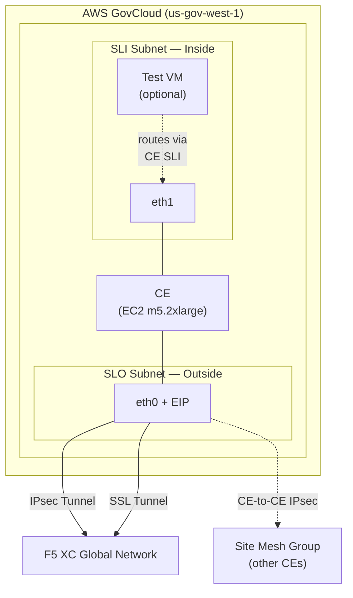
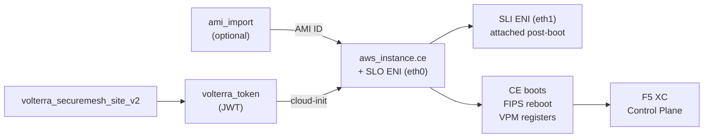

# F5 XC SMSv2 Customer Edge — AWS GovCloud

Deploy an [F5 Distributed Cloud](https://docs.cloud.f5.com/) Secure Mesh Site v2 (SMSv2) Customer Edge node in **AWS GovCloud**.

## Architecture



## Prerequisites

- **Terraform** >= 1.3
- **AWS CLI** configured for GovCloud (`aws configure --profile f5xc-aws-govcloud`)
- **F5 XC tenant** with API credentials (.p12 file) -- password provided via `VES_P12_PASSWORD` env var
- **Existing AWS resources**: VPC, two subnets (SLO with internet gateway route + SLI)
- **CE AMI** -- either a known AMI ID or a download URL from the F5 XC Console (see Image Options below)
- **Local tools**: `curl`, `gunzip` (only needed if importing an image from URL)

### CE Instance Sizing

| Resource | Minimum |
|----------|---------|
| vCPUs    | 8       |
| RAM      | 32 GB   |
| Disk     | 80 GB   |

Recommended instance type: `m5.2xlarge` (8 vCPU, 32 GB RAM, ENA networking).

### Provider Versions

| Provider | Constraint | Tested With |
|----------|------------|-------------|
| [aws](https://registry.terraform.io/providers/hashicorp/aws/latest) | >= 5.0.0 | 6.34.0 |
| [volterra](https://registry.terraform.io/providers/volterraedge/volterra/latest) | >= 0.11.42 | 0.11.47 |
| [random](https://registry.terraform.io/providers/hashicorp/random/latest) | >= 3.4.0 | 3.8.1 |

## Quick Start

### 1. AWS GovCloud Login

```bash
source ./scripts/setup-aws-gov.sh
```

This will verify your AWS CLI profile, confirm account access, and export `AWS_PROFILE` and `AWS_REGION` for Terraform.

For SSO or static credential setup, see the script output.

### 2. Set the F5 XC P12 Password

```bash
export VES_P12_PASSWORD="your-p12-password"
```

### 3. Configure and Deploy

```bash
cp terraform.tfvars.example terraform.tfvars
# Edit terraform.tfvars with your values

terraform init
terraform plan
terraform apply
```

### 4. Verify Registration

After boot, the CE will automatically register with the F5 XC control plane. This process may take **15-30 minutes** as the CE enables FIPS mode (reboot), loads container images, and performs initial setup.

Monitor progress in the F5 XC Console:

**Multi-Cloud Network Connect > Overview > Sites** -- site should progress through Approval > Registration > Upgrading > **Online**.

> The registration token is valid for **24 hours**. If it expires, re-run `terraform apply` to generate a new one.

### 5. Post-Registration: Site Mesh Group Setup

When `enable_site_mesh_group = true` (the default), the site is configured for site-to-site connectivity over the SLO public IP. After the CE registers, complete these manual steps in the F5 XC Console:

1. Navigate to **Multi-Cloud Network Connect > Manage > Site Management > Secure Mesh Sites v2**
2. Select the site > **Edit** > **Node Information**
3. Set the **Public IP** field to the SLO public IP address (`terraform output slo_public_ip`)
4. On the SLO interface (eth0), enable **Use for Site to Site Connectivity**
5. Save changes

These node-level properties are populated by the CE during registration and cannot be managed declaratively via Terraform.

### 6. SSH Access

The CE admin username is `cloud-user`. The default login shell is the **SiteCLI** (an interactive management console), not bash:

```bash
ssh cloud-user@$(terraform output -raw slo_public_ip)
```

From SiteCLI, you can run host commands via `execcli`:
```
>>> execcli journalctl -u vpm --no-pager
>>> execcli crictl-images
```

> **Note:** The SLO security group does **not** include an inbound SSH rule by default. Add one manually for debugging if needed -- do not commit SSH inbound rules to the template.

## Image Options

The CE AMI can be provided in two ways:

### Option 1: Direct AMI ID (recommended)

Set `ami_id` in your tfvars to a known F5 XC CE AMI. This is the fastest path -- no download or import needed.

```hcl
ami_id = "ami-0123456789abcdef0"
```

### Option 2: Import from F5 XC Console URL

Set `ce_image_download_url` and `s3_bucket_name`. Terraform will download the image, upload to S3, and run `ec2 import-image` automatically.

```hcl
ce_image_download_url = "https://vesio.blob.core.windows.net/releases/rhel/9/x86_64/images/securemeshV2/aws_single/f5xc-ce-<version>.vhd.gz"
s3_bucket_name        = "my-ce-image-staging"
```

> **Note:** The first apply with image import takes **15-45 minutes** due to download, decompression, and import. Subsequent applies skip the import if the AMI already exists.

### How to Get the CE Image Download URL

The Volterra Terraform provider does not expose the image download URL as an output. You must obtain it manually from the F5 XC Console before running `terraform plan`:

1. Log in to the **F5 XC Console**
2. Navigate to **Multi-Cloud Network Connect > Site Management > Secure Mesh Sites v2**
3. Click **Add Secure Mesh Site v2** to create a temporary site
   - Name: any placeholder (e.g. `temp-image-grab`)
   - Provider: **AWS** (or your target cloud)
   - Fill in required fields with dummy values -- the site will not be deployed
4. **Save** the site
5. In the site list, click the **...** (kebab menu) next to the temp site > **Copy Image Name**
6. Paste the URL into your `terraform.tfvars` as `ce_image_download_url`
7. **Delete the temporary site** -- it is no longer needed

The URL points to a versioned VHD image (e.g. `f5xc-ce-9.2025.10-20250116213509.vhd.gz`). When F5 releases a new CE image, repeat the steps above to get the updated URL and re-run `terraform apply` to import the new AMI.

## Inputs

| Name | Description | Default | Required |
|---|---|---|---|
| `f5xc_api_url` | F5 XC tenant API URL | -- | **yes** |
| `f5xc_api_p12_file` | Path to API .p12 credential file | -- | **yes** |
| `aws_region` | AWS GovCloud region | `us-gov-west-1` | no |
| `aws_profile` | AWS CLI profile name (null = default chain) | `null` | no |
| `vpc_id` | Existing VPC ID | -- | **yes** |
| `outside_subnet_id` | SLO (outside) subnet -- needs outbound internet | -- | **yes** |
| `inside_subnet_id` | SLI (inside) subnet -- LAN/workload traffic | -- | **yes** |
| `ami_id` | CE AMI ID (null = use image import) | `null` | see above |
| `ce_image_download_url` | CE image download URL from Console | `null` | see above |
| `s3_bucket_name` | S3 bucket for staging image import | `null` | with URL |
| `site_name` | SMSv2 site name (DNS-1035 compliant) | -- | **yes** |
| `site_description` | Site description in F5 XC | `F5 XC SMSv2 CE in AWS GovCloud` | no |
| `instance_type` | EC2 instance type (min 8 vCPU / 32 GB) | `m5.2xlarge` | no |
| `disk_size_gb` | Root volume size in GB | `128` | no |
| `ssh_public_key` | SSH public key for `cloud-user` access | -- | **yes** |
| `enable_etcd_fix` | Temporary cloud-init fix for blank ETCD_IMAGE | `true` | no |
| `enable_site_mesh_group` | Enable site mesh group on SLO for site-to-site connectivity | `true` | no |
| `slo_security_group_id` | Existing SG for SLO ENI (null = create new) | `null` | no |
| `sli_security_group_id` | Existing SG for SLI ENI (null = create new) | `null` | no |
| `slo_private_ip` | Static SLO IP (null = DHCP) | `null` | no |
| `sli_private_ip` | Static SLI IP (null = DHCP) | `null` | no |
| `create_eip` | Create an Elastic IP on the SLO ENI | `true` | no |
| `deploy_test_vm` | Deploy a Ubuntu test VM on the inside (SLI) subnet | `false` | no |
| `test_vm_instance_type` | Instance type for the test VM | `t3.micro` | no |
| `test_vm_private_ip` | Static IP for the test VM (null = DHCP) | `null` | no |
| `test_vm_remote_cidrs` | Remote inside CIDRs to route via CE SLI (e.g. on-prem, Azure) | `[]` | no |
| `tags` | AWS resource tags | `{}` | no |

## Outputs

| Name | Description |
|---|---|
| `site_name` | F5 XC site name |
| `site_token` | Registration token (sensitive) |
| `instance_id` | EC2 instance ID |
| `slo_private_ip` | SLO (outside) private IP |
| `sli_private_ip` | SLI (inside) private IP |
| `slo_public_ip` | SLO Elastic IP (if enabled) |
| `ami_id` | CE AMI ID used for the instance |
| `test_vm_private_ip` | Test VM private IP on the inside subnet |
| `test_vm_instance_id` | Test VM EC2 instance ID |

## File Structure

```
.
├── versions.tf              # Providers (aws, volterra, random)
├── variables.tf             # Input variables
├── main.tf                  # AWS infra (SGs, ENIs, EIP, IAM, EC2)
├── f5xc.tf                  # SMSv2 site, registration token, cloud-init
├── image.tf                 # AMI import from download URL (optional)
├── test_vm.tf               # Test VM on inside subnet (optional, deploy_test_vm)
├── outputs.tf               # Outputs
├── terraform.tfvars.example # Example variable values
├── scripts/
│   └── setup-aws-gov.sh     # AWS GovCloud CLI setup helper
├── creds/                   # .p12 credential files (gitignored)
└── .gitignore
```

## How It Works



1. **`terraform_data.ami_import`** (optional) -- Downloads the CE image from the F5 XC repo, decompresses it, uploads to S3, and runs `ec2 import-image`. Skips entirely if `ami_id` is set or if the AMI already exists. Creates the `vmimport` IAM service role if needed.
2. **`aws_instance.ce`** -- Launches the CE with the primary ENI (SLO/eth0) attached at boot. The SLI ENI (eth1) is attached post-boot via `aws_network_interface_attachment`.
3. **`volterra_securemesh_site_v2`** -- Creates the SMSv2 site object in F5 XC with `aws { not_managed {} }` (manual/unmanaged deployment). **Offline Survivability Mode** is enabled by default, allowing the CE to continue processing traffic for up to 7 days if connectivity to the F5 XC control plane is lost.
4. **`volterra_token`** -- Generates a JWT registration token (`type = 1`) bound to the site name.
5. **Cloud-init** -- Writes the JWT to `/etc/vpm/user_data` on the instance via `user_data_base64`.
6. **CE boots** -- VPM reads the JWT (which carries cluster name, tenant, and registration endpoints), enables FIPS mode (reboot), and auto-registers with the F5 XC control plane over IPsec/SSL tunnels.

### Existing Infrastructure Model

This template deploys into an **existing** AWS environment. It does **not** create or manage:

- VPCs
- Subnets
- Internet Gateways / NAT Gateways
- Route Tables

All of these are referenced as data sources. `terraform destroy` only removes CE-specific resources (EC2, ENIs, EIP, SGs, IAM role/profile, SSH key pair, F5 XC site/token).

**Security Groups** -- By default, the template creates lightweight SGs for the SLO and SLI ENIs. In enterprise environments with centrally managed SGs, pass existing SG IDs via `slo_security_group_id` and `sli_security_group_id` to skip SG creation entirely.

**Route Tables** -- Not managed by this template. Configure routes on the SLI subnet externally if you need to route workload traffic through the CE.

### Networking Details

- **SLO (eth0)** -- Outside interface, primary ENI. Outbound internet required for F5 XC registration. Optional Elastic IP. Default SG allows all outbound.
- **SLI (eth1)** -- Inside interface, attached post-boot. Used for LAN/workload traffic. Default SG allows all inbound and outbound.
- Both ENIs have **source/dest check disabled** (equivalent to Azure IP forwarding).
- **ENA (Elastic Network Adapter)** is enabled by default on m5 instance types -- no additional configuration needed.
- Resource names include a random 4-character hex suffix to avoid conflicts.

### Tags

All resources are tagged with:
- `ves-io-site-name` -- Required by F5 XC CE for cloud discovery
- `kubernetes.io/cluster/<site-name>` = `Owned` -- Required by F5 XC CE
- Custom tags from the `tags` variable

## Cleanup

```bash
terraform destroy
```

This removes all Terraform-managed resources (EC2, ENIs, EIP, SGs, IAM role/profile, key pair, F5 XC site and token). If you used the image import path, the AMI and its backing snapshot are **not** deleted by Terraform -- remove them manually if desired:

```bash
aws ec2 deregister-image --image-id ami-xxxx --region us-gov-west-1
aws ec2 delete-snapshot --snapshot-id snap-xxxx --region us-gov-west-1
```

## References

- [volterra_securemesh_site_v2](https://registry.terraform.io/providers/volterraedge/volterra/latest/docs/resources/volterra_securemesh_site_v2)
- [SecureMesh Site v2 API](https://docs.cloud.f5.com/docs-v2/api/views-securemesh-site-v2)
- [Create Secure Mesh Site v2](https://docs.cloud.f5.com/docs-v2/multi-cloud-network-connect/how-to/site-management/create-secure-mesh-site-v2)
- [SMSv2 Automation (DevCentral)](https://community.f5.com/kb/technicalarticles/how-to-deploy-an-f5xc-smsv2-site-with-the-help-of-automation/342198)
- [CE Site Sizing](https://docs.cloud.f5.com/docs-v2/multi-cloud-network-connect/reference/ce-site-sizing)
